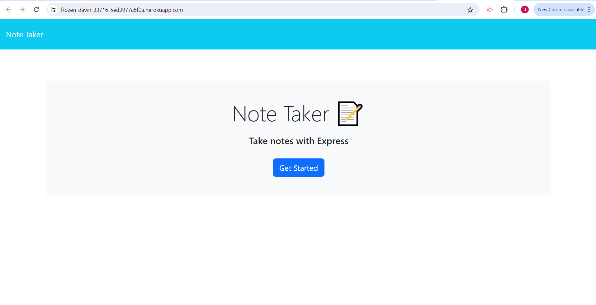
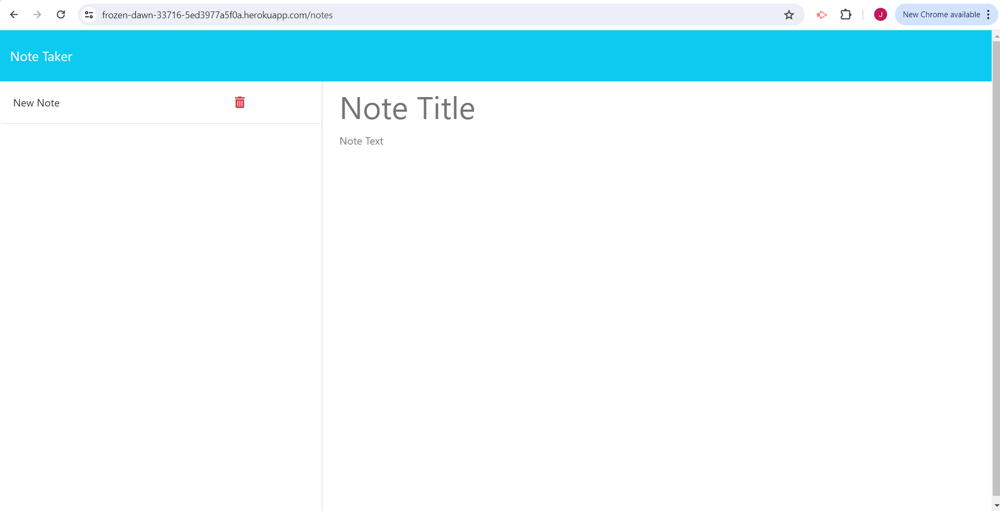
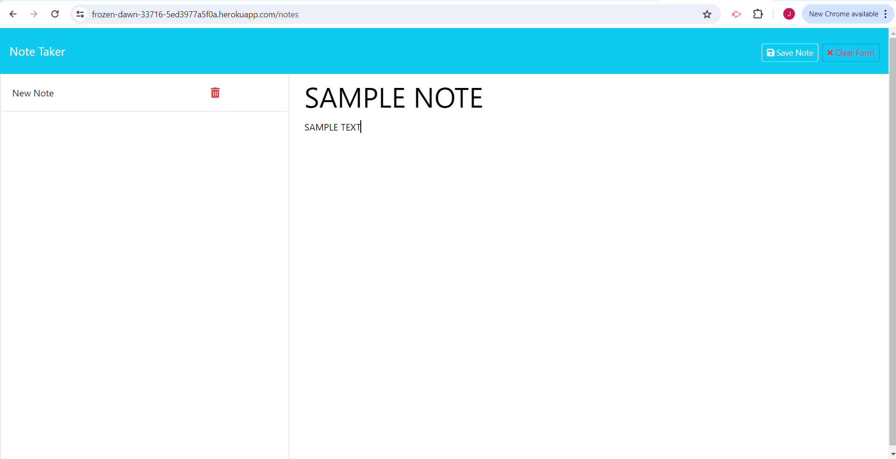
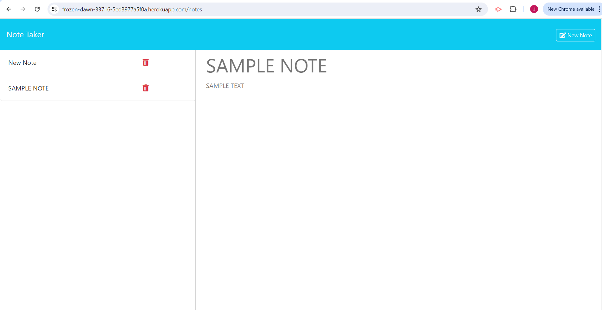
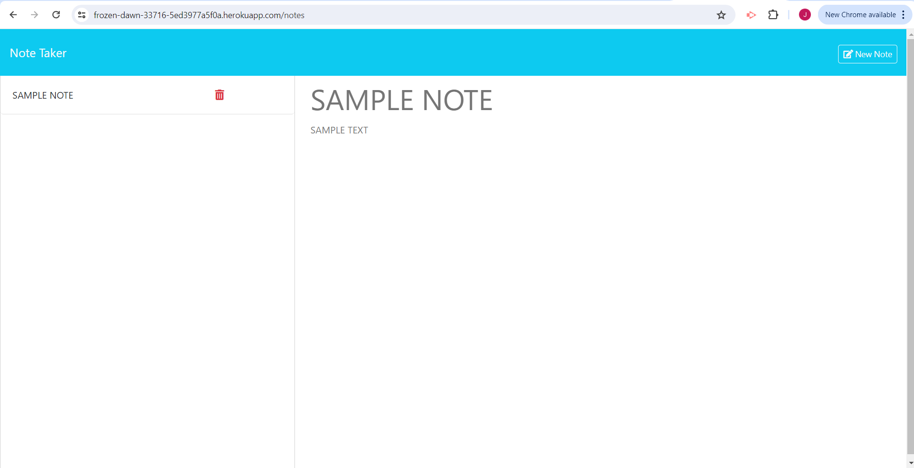

# Note Taker

## Description

Have an idea or task you need to remember? This application allows users to conveniently write, save, and delete notes.

## Table of Contents (Optional)

- [Installation](#installation)
- [Usage](#usage)
- [Credits](#credits)
- [License](#license)

## Installation

This application can be found at: 
https://frozen-dawn-33716-5ed3977a5f0a.herokuapp.com/

## Usage

When visiting the site, users are greeted with homepage to get started.

After clicking "Get Started", users are brought to a notes page.

Users can add a note title and note text. After some text have been input, an option to clear form appears. Once title and text are both entered, an option to save note appears. 

When users select "Save Note", the note is saved and can be seen on the left side of the page.

If users want to remove a note from the list, they can simply click the red trash can icon next to the note title.

## Credits

The documentation for Express.js helped with writing the routing of this application.
https://expressjs.com/en/guide/routing.html#express-router

Heroku was used to deploy this application. 
https://devcenter.heroku.com/articles/git#creating-a-heroku-remote

Erik Hirsch assisted with writing some of the router methods.
ehirsch@instructors.2u.com

## License

MIT License

Copyright (c) 2024 jinkc21

Permission is hereby granted, free of charge, to any person obtaining a copy
of this software and associated documentation files (the "Software"), to deal
in the Software without restriction, including without limitation the rights
to use, copy, modify, merge, publish, distribute, sublicense, and/or sell
copies of the Software, and to permit persons to whom the Software is
furnished to do so, subject to the following conditions:

The above copyright notice and this permission notice shall be included in all
copies or substantial portions of the Software.

THE SOFTWARE IS PROVIDED "AS IS", WITHOUT WARRANTY OF ANY KIND, EXPRESS OR
IMPLIED, INCLUDING BUT NOT LIMITED TO THE WARRANTIES OF MERCHANTABILITY,
FITNESS FOR A PARTICULAR PURPOSE AND NONINFRINGEMENT. IN NO EVENT SHALL THE
AUTHORS OR COPYRIGHT HOLDERS BE LIABLE FOR ANY CLAIM, DAMAGES OR OTHER
LIABILITY, WHETHER IN AN ACTION OF CONTRACT, TORT OR OTHERWISE, ARISING FROM,
OUT OF OR IN CONNECTION WITH THE SOFTWARE OR THE USE OR OTHER DEALINGS IN THE
SOFTWARE.

---
